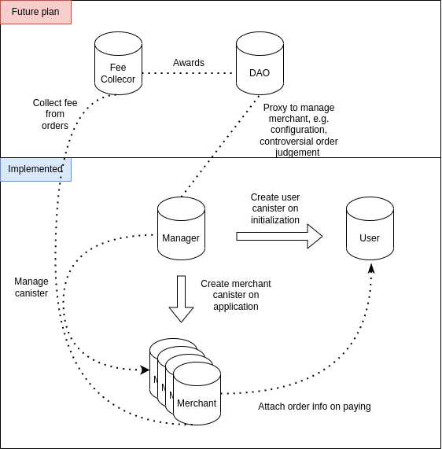

# ePay

ePay is a payment solution on Internet Computer that accommodate the needs of both physical and virtual commerce. In the ever-evolving digital landscape, the need for robust and secure payment solutions is paramount.  ePay is an innovative, blockchain-based payment platform built on the Internet Computer. Designed to foster seamless and private transactions, ePay aims to bridge the gap between users and merchants through a decentralized, scalable, and highly efficient ecosystem.

## Architecture

While pertaining the payment flows that centralized services as Paypal and Alipay provide, the main problem solved in this project was the scalability of the payment solution, which was designed using a bus-based architecture, i.e. a single management canister with a slave user canister and multiple slave merchant canisters. This has the advantage of greatly reducing the indexing problems caused by an excessive number of orders, improving the efficiency of queries, additions and udpates, and similarly, even if a merchant canister stores a huge number of orders and causes the above indexing problem, it can be solved by adding new merchant canisters.



## Features & Mechanisms

+ User to merchant payment 

  Once a merchant has set up an order, the payer can view the order,  approve the tokens the order requires, then pay the order. On paying the order, the merchant canister issues multiple`transferFrom(payer, merchant_canister, amount)` to hold the tokens. 

+ On-hold mechanism 

  An order will be held(added to a pool) for 7days(depends on the configuration) before the merchant can deposit the tokens belongs to the order. 

+ Controversial orders

  Customers can comment orders to mark the orders to be controversial, in which the order will be held till merchant/manager resolve the issues that customers have. Customers and merchants can communicate there too.

+ Order refund 

  Merchant or manager can refund the order to the payer. 

+ Notifying service 

  Merchant can set up a notification service(Http Call) where when orders get paid, get commented and etc. This feature requires merchants set up their own http server to receive notification.

## TODOs

+ Bill splitting
+ Fee scheme
+ Payment SDK 
+ DAO based management
+ ICRC token support
+ Stable memory update

## Developer guides 

Before start, clone this project with git 

```
git clone --recurse-submodules https://github.com/bianyuanop/ePay
```

You need to create an local manager canister first by typing 

```shell
dfx canister create manager
```

After this, you need to change the principal of MANAGER under `scripts/info.ts` to the principal you just get. 

Also, one DIP20 token is needed for testing the functionalities of the system. You can simply type 

```shell
./token_deployment/dip20/deploy.sh
```

and after deployment, you need to change the principal of TOKEN under `scripts/info.ts` as well.

The final step is to type 

```shell
./scripts/install_dev.sh
```

to have the whole developing environment on.

### Tests

[tests](./tests)

### Frontend 

A demo frontend can be found [here](https://github.com/bianyuanop/epay_frontend)

